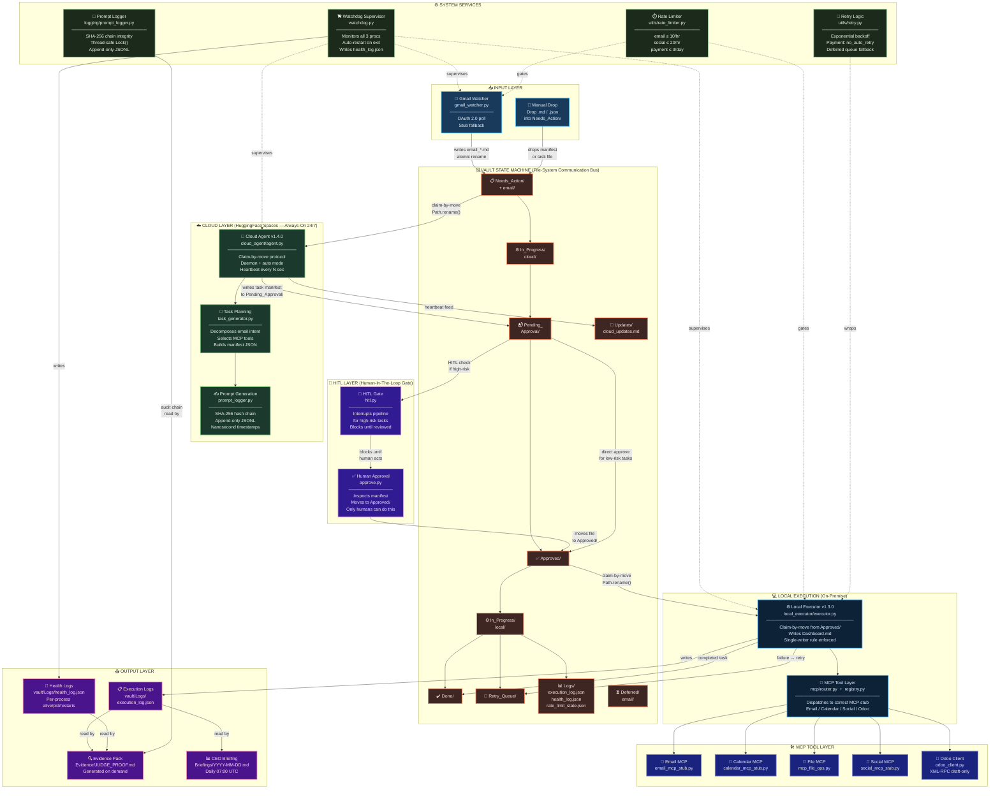

# AI Employee Vault – Platinum Tier Architecture

> **Full distributed architecture diagram** for the AI Employee Vault Platinum Tier.
> This document is the canonical visual reference for hackathon judges and auditors.

---

## System Architecture Diagram



---

## Architecture Layer Summary

| Layer | Components | Technology |
|---|---|---|
| **Input** | Gmail Watcher, Manual Drop | Python, Gmail OAuth 2.0, atomic rename |
| **Cloud** | Cloud Agent v1.4.0, Task Planner, Prompt Logger | Python, HuggingFace Spaces, SHA-256 |
| **Vault** | 10-directory state machine | File system, `Path.rename()` distributed lock |
| **HITL** | hitl.py, approve.py | Human-in-the-loop gate |
| **Local Exec** | Local Executor v1.3.0, MCP Router | Python, XML-RPC, importlib |
| **MCP Tools** | Email, Calendar, File, Social, Odoo | Stub layer + real Odoo XML-RPC |
| **Services** | Watchdog, Rate Limiter, Retry, Logger | threading.Lock, JSONL, exponential backoff |
| **Output** | Execution Logs, Evidence Pack, CEO Briefing | Markdown, JSONL, SHA-256 chain |

---

## Claim-by-Move Protocol (Distributed Lock)

```
Needs_Action/<file>
    │
    │  Cloud Agent: Path.rename() — atomic OS-level lock
    ▼
In_Progress/cloud/<file>
    │
    │  Cloud Agent processes, generates manifest
    ▼
Pending_Approval/<manifest>.json
    │
    │  (HITL gate if high-risk)  →  Human reviews  →  Approved/
    │  (auto-approve low-risk)   →  Approved/
    ▼
Approved/<manifest>.json
    │
    │  Local Executor: Path.rename() — atomic OS-level lock
    ▼
In_Progress/local/<manifest>.json
    │
    │  Local Executor calls MCP tools
    ▼
Done/<manifest>.json  (success)
Retry_Queue/<manifest>.json  (failure, payment tasks: no_auto_retry)
```

**Why atomic rename?** `os.rename()` / `Path.rename()` is guaranteed atomic on
POSIX file systems (single-syscall). The first process to call rename "wins" —
no second process can claim the same file. This eliminates the need for a
distributed lock service (Redis, ZooKeeper, etcd) while preserving all
concurrency guarantees.

---

## Data Flow — Single Task End-to-End

```
[Gmail]  →  email_001.md  →  vault/Needs_Action/email/
                                        │ Cloud Agent claims
                                        ▼
                              vault/In_Progress/cloud/email_001.md
                                        │ generate manifest
                                        ▼
                              vault/Pending_Approval/task_abc.json
                                        │ HITL gate (if needed)
                                        ▼
                                    Human reviews
                                        │ approve
                                        ▼
                              vault/Approved/task_abc.json
                                        │ Local Executor claims
                                        ▼
                              vault/In_Progress/local/task_abc.json
                                        │ MCP tool executes
                                        ▼
                              vault/Done/task_abc.json
                                        │
                              history/prompt_log.json  (SHA-256 chain entry)
                              vault/Logs/execution_log.json  (JSONL record)
```

---

## Permission Boundary Matrix

| Component | Can Read | Can Write | External Net | Dashboard.md |
|---|---|---|---|---|
| Cloud Agent | Needs_Action/, Done/ | Pending_Approval/, In_Progress/cloud/, Updates/ | HuggingFace (inbound) | ❌ PermissionError |
| Gmail Watcher | — | Needs_Action/email/, Deferred/email/ | Gmail API | ❌ Never |
| Local Executor | Pending_Approval/, Approved/ | In_Progress/local/, Done/, Logs/, Retry_Queue/ | Odoo XML-RPC | ✅ Only writer |
| Watchdog | — | Logs/health_log.json | — | ❌ Never |
| Human Approver | Pending_Approval/ | Approved/ | — | — |

---

*Generated for AI Employee Vault – Platinum Tier v1.4.0*
*Evidence artifact — for judge verification and system audit*
