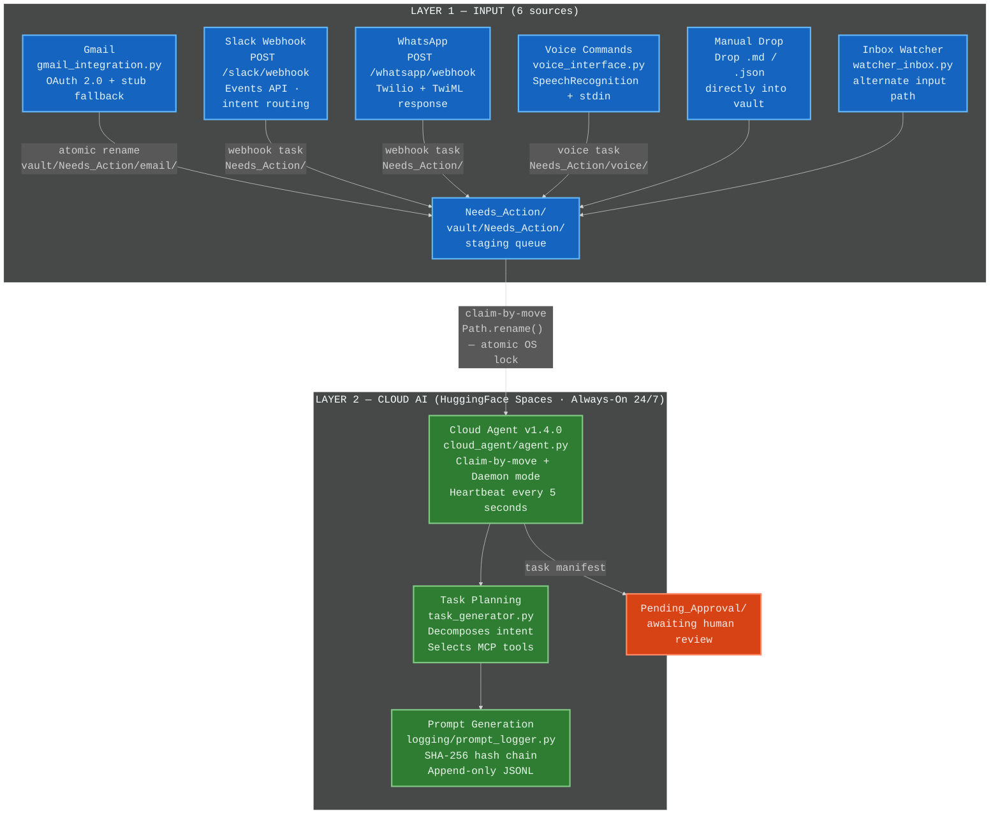

# AI Employee Vault – Platinum Tier Architecture V2

> **Architecture reference** — 7-layer distributed AI pipeline with full integration inputs.
> Zoom diagrams: [zoom_1_input_cloud.mmd](zoom_1_input_cloud.mmd) · [zoom_2_hitl.mmd](zoom_2_hitl.mmd) · [zoom_3_executor_tools.mmd](zoom_3_executor_tools.mmd) · [zoom_4_vault_outputs.mmd](zoom_4_vault_outputs.mmd)

---

## Layer 1 — INPUT (Updated: All Integration Sources)



---

## Full 7-Layer Architecture

```mermaid
%%{init: {'theme': 'dark', 'themeVariables': {
  'primaryColor':    '#1565c0',
  'primaryTextColor':'#e3f2fd',
  'primaryBorderColor':'#64b5f6',
  'lineColor':       '#4fc3f7',
  'secondaryColor':  '#1b5e20',
  'tertiaryColor':   '#0a0e1a',
  'background':      '#0a0e1a',
  'mainBkg':         '#0d1117',
  'nodeBorder':      '#4fc3f7',
  'clusterBkg':      '#1a1a2e',
  'titleColor':      '#ffd700',
  'edgeLabelBackground':'#1a1a2e',
  'fontFamily': 'monospace'
}}}%%
flowchart TD

    classDef inputCls  fill:#1565c0,stroke:#64b5f6,color:#e3f2fd,stroke-width:2px,font-size:13px
    classDef cloudCls  fill:#2e7d32,stroke:#81c784,color:#e8f5e9,stroke-width:2px,font-size:13px
    classDef hitlCls   fill:#6a1b9a,stroke:#ce93d8,color:#f3e5f5,stroke-width:2px,font-size:13px
    classDef localCls  fill:#00695c,stroke:#80cbc4,color:#e0f2f1,stroke-width:2px,font-size:13px
    classDef toolCls   fill:#1565c0,stroke:#90caf9,color:#e3f2fd,stroke-width:1px,font-size:12px
    classDef vaultCls  fill:#d84315,stroke:#ff8a65,color:#fbe9e7,stroke-width:2px,font-size:13px
    classDef outCls    fill:#ad1457,stroke:#f48fb1,color:#fce4ec,stroke-width:2px,font-size:13px
    classDef svcCls    fill:#37474f,stroke:#90a4ae,color:#eceff1,stroke-width:2px,font-size:13px

    %% ═══════════════════════════════════════════════════════════
    %% LAYER 1 — INPUT
    %% ═══════════════════════════════════════════════════════════
    subgraph INPUT["[ IN ]  INPUT LAYER  —  6 Integration Sources"]
        direction LR
        GW["Gmail\ngmail_integration.py\nOAuth 2.0 + stub fallback"]
        SL["Slack Webhook\nPOST /slack/webhook\nEvents API"]
        WA["WhatsApp\nPOST /whatsapp/webhook\nTwilio + TwiML"]
        VC["Voice Commands\nvoice_interface.py\nSpeechRecognition + stdin"]
        MD["Manual Drop\n.md / .json into vault"]
        IB["Inbox Watcher\nwatcher_inbox.py"]
        NA["Needs_Action/\nstaging queue"]
    end

    %% ═══════════════════════════════════════════════════════════
    %% LAYER 2 — CLOUD AI
    %% ═══════════════════════════════════════════════════════════
    subgraph CLOUD["[ AI ]  CLOUD AI LAYER  —  HuggingFace Spaces  (Always-On 24/7)"]
        direction LR
        CA["Cloud Agent v1.4.0\ncloud_agent/agent.py\nClaim-by-move · Daemon mode\nHeartbeat every 5 seconds"]
        TP["Task Planning\ntask_generator.py\nDecomposes intent\nSelects MCP tools"]
        PG["Prompt Generation\nlogging/prompt_logger.py\nSHA-256 hash chain\nAppend-only JSONL"]
        CA --> TP --> PG
    end

    %% ═══════════════════════════════════════════════════════════
    %% LAYER 3 — HITL
    %% ═══════════════════════════════════════════════════════════
    subgraph HITL["[ HUMAN ]  HUMAN-IN-THE-LOOP GATE"]
        direction LR
        HG["HITL Gate\nhitl.py\nInterrupts pipeline\nfor high-risk tasks"]
        HA["Human Approval\napprove.py\nMoves Pending → Approved"]
        HR["Rejection Handling\nArchived to vault/Logs/"]
        HG --> HA
        HG --> HR
    end

    %% ═══════════════════════════════════════════════════════════
    %% LAYER 4 — LOCAL EXECUTION
    %% ═══════════════════════════════════════════════════════════
    subgraph LOCAL["[ RUN ]  LOCAL EXECUTION"]
        LE["Local Executor v1.3.0\nlocal_executor/executor.py\nClaim-by-move · Single-writer Dashboard.md"]
        subgraph MCP["MCP TOOL LAYER  —  mcp/router.py + registry.py"]
            direction LR
            EM["Email MCP\nemail_mcp_stub.py"]
            CM["Calendar MCP\ncalendar_mcp_stub.py"]
            FM["File MCP\nmcp_file_ops.py"]
            SM["Social MCP\nsocial_mcp_stub.py"]
            OD["Odoo Client\nodoo_client.py\nXML-RPC draft-only"]
        end
        LE --> MCP
    end

    %% ═══════════════════════════════════════════════════════════
    %% LAYER 5 — VAULT STATE MACHINE
    %% ═══════════════════════════════════════════════════════════
    subgraph VAULT["[ VAULT ]  VAULT STATE MACHINE  —  File-System Communication Bus"]
        direction LR
        VP["Pending_Approval/\nCloud Agent writes here"]
        VA["Approved/\nHuman-approved tasks"]
        VD["Done/\nCompleted tasks"]
        VR["Retry_Queue/\nFailed Odoo tasks"]
        VL["Logs/\nexecution_log.json\nhealth_log.json"]
    end

    %% ═══════════════════════════════════════════════════════════
    %% LAYER 6 — OUTPUT & REPORTING
    %% ═══════════════════════════════════════════════════════════
    subgraph OUTPUT["[ OUT ]  OUTPUT & REPORTING"]
        direction LR
        EL["Execution Logs\nvault/Logs/execution_log.json"]
        EP["Evidence Pack\nEvidence/JUDGE_PROOF.md"]
        CB["CEO Report\nEvidence/CEO_REPORT.md\nPOST /reports/ceo"]
        HL["Health Logs\nvault/Logs/health_log.json"]
        MT["Dashboard Metrics\nGET /metrics"]
        DL["AI Decision Log\nEvidence/AI_DECISION_LOG.md"]
        HRP["Health Report\nEvidence/SYSTEM_HEALTH_REPORT.md"]
    end

    %% ═══════════════════════════════════════════════════════════
    %% LAYER 7 — SYSTEM SERVICES
    %% ═══════════════════════════════════════════════════════════
    subgraph SVCS["[ SVC ]  SYSTEM SERVICES"]
        direction LR
        WD["Watchdog Supervisor\nwatchdog.py\nMonitors 3 processes\nAuto-restart · health_log"]
        RL["Rate Limiter\nutils/rate_limiter.py\nemail ≤10/hr · social ≤20/hr"]
        RT["Retry Logic\nutils/retry.py\nExponential backoff"]
        PL["Prompt Logger\nlogging/prompt_logger.py\nSHA-256 hash chain"]
    end

    %% ═══════════════════════════════════════════════════════════
    %% CONNECTIONS
    %% ═══════════════════════════════════════════════════════════
    GW  -->|"atomic rename\nvault/Needs_Action/email/"| NA
    SL  -->|"webhook task\nNeeds_Action/"| NA
    WA  -->|"webhook task\nNeeds_Action/"| NA
    VC  -->|"voice task\nNeeds_Action/voice/"| NA
    MD  --> NA
    IB  --> NA

    NA  -->|"claim-by-move\nPath.rename()"| CA
    CA  -->|"task manifest"| VP
    CA  -->|"heartbeat feed"| VL

    VP  -->|"HITL check\nif high-risk"| HG
    HA  -->|"moves to\nApproved/"| VA
    VP  -->|"auto-approve\nlow-risk"| VA

    VA  -->|"claim-by-move\nPath.rename()"| LE
    EM & CM & FM & SM & OD -->|"result"| LE
    LE  -->|"success"| VD
    LE  -->|"failure"| VR
    LE  -->|"JSONL record"| EL

    WD  -.->|"supervises"| CA
    WD  -.->|"supervises"| GW
    WD  -.->|"supervises"| LE
    WD  -->|"writes"| HL

    RL  -.->|"gates"| GW
    RL  -.->|"gates"| LE
    RT  -.->|"wraps"| LE
    PL  -->|"SHA-256 chain"| EP

    EL  -->|"read by"| EP
    HL  -->|"read by"| EP
    EL  -->|"read by"| CB
    EL  -->|"feeds"| MT
    LE  -->|"decision record"| DL
    WD  -->|"component status"| HRP

    class GW,SL,WA,VC,MD,IB,NA inputCls
    class CA,TP,PG cloudCls
    class HG,HA,HR hitlCls
    class LE localCls
    class EM,CM,FM,SM,OD toolCls
    class VP,VA,VD,VR,VL vaultCls
    class EL,EP,CB,HL,MT,DL,HRP outCls
    class WD,RL,RT,PL svcCls
```



---

## Architecture Layer Summary

| # | Layer | Badge | Key Components |
|---|---|---|---|
| 1 | Input | `[IN]` | Gmail, Slack Webhook, WhatsApp Webhook, Voice Commands, Manual Drop, Needs_Action Queue |
| 2 | Cloud AI | `[AI]` | Cloud Agent v1.4.0, Task Planning, Prompt Generation |
| 3 | Human-in-the-Loop | `[HUMAN]` | HITL Gate, Human Approval, Rejection Handling |
| 4 | Local Execution | `[RUN]` | Local Executor v1.3.0, MCP Tool Layer (5 tools) |
| 5 | Vault State Machine | `[VAULT]` | Pending_Approval, Approved, Done, Retry_Queue, Logs |
| 6 | Output & Reporting | `[OUT]` | Execution Logs, Evidence Pack, CEO Report, Health Logs, Dashboard Metrics, AI Decision Log, Health Report |
| 7 | System Services | `[SVC]` | Watchdog, Rate Limiter, Retry Logic, Prompt Logger |

---

## Integration Input Sources

| Source | File | Protocol | Vault Target |
|---|---|---|---|
| **Gmail** | `integrations/gmail_integration.py` | OAuth 2.0 + stub fallback | `vault/Needs_Action/email/` |
| **Slack** | `integrations/slack_integration.py` | POST /slack/webhook · Events API | `vault/Needs_Action/` |
| **WhatsApp** | `integrations/whatsapp_integration.py` | POST /whatsapp/webhook · Twilio TwiML | `vault/Needs_Action/` |
| **Voice Commands** | `integrations/voice_interface.py` | SpeechRecognition + stdin fallback | `vault/Needs_Action/voice/` |
| **Manual Drop** | — | Drop `.md` / `.json` directly | `vault/Needs_Action/` |
| **Inbox Watcher** | `watchers/watcher_inbox.py` | File watch | `vault/Needs_Action/` |

---

## Claim-by-Move Protocol

```
vault/Needs_Action/<source>/<file>
    │  Cloud Agent: Path.rename() — atomic OS lock
    ▼
vault/In_Progress/cloud/<file>
    │  Process, generate manifest
    ▼
vault/Pending_Approval/<manifest>.json
    │  HITL gate (high-risk) → human reviews → Approved/
    │  auto-approve (low-risk)               → Approved/
    ▼
vault/Approved/<manifest>.json
    │  Local Executor: Path.rename() — atomic OS lock
    ▼
vault/In_Progress/local/<manifest>.json
    │  MCP tools execute
    ▼
vault/Done/<manifest>.json          ← success
vault/Retry_Queue/<manifest>.json   ← failure (no_auto_retry for payments)
```

*AI Employee Vault – Platinum Tier v1.4.0 — Architecture V2*
